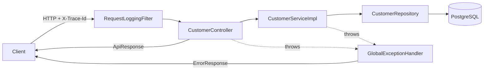

# 00-template-service

The **baseline template** every other project in the Enterprise System Design Lab is copied from. It is a small, correct, production-shaped Spring Boot service implementing a single domain (Customer) end-to-end, so that later projects inherit consistent structure, conventions, and cross-cutting concerns instead of reinventing them.

> Copy this project, rename the package/domain, and you start every new section already wired for persistence, validation, error handling, structured logging, API docs, containers, and tests.

---

## Architectural Objective

Establish a **clean layered architecture** (Controller → Service → Repository → Database) and a fixed set of cross-cutting contracts that are reused unchanged across the whole lab — without pulling in any technology-specific concern (no Kafka, Redis, RabbitMQ, Kubernetes, OAuth2, OpenSearch, or AWS). Those belong to their own dedicated sections.

## Business Scenario

The shared lab domain is a Supply Chain & Order Fulfillment Platform. This template uses the **Customer** service — the simplest aggregate (register and manage customers) — as the vehicle to demonstrate the baseline without domain noise.

## Problem Statement

Dozens of independent example projects need to look and behave the same: identical response/error envelopes, the same exception-to-HTTP mapping, the same logging/tracing, the same migration and testing discipline. Re-deriving these per project is inconsistent and error-prone. A single, well-factored template solves this once.

## Solution & Design Decisions

A **Maven multi-module** build:

- **`common-library`** — a reusable jar with the shared foundation: `ApiResponse`, unified `ErrorResponse`, the `BaseException` hierarchy, `GlobalExceptionHandler`, `AuditEntity`, `Constants`, and utilities.
- **`customer-service`** — a runnable Spring Boot app that derives from the library and implements the Customer domain across the layers.

Key decisions (and why):

| Decision | Rationale |
|---|---|
| Multi-module (library + app) | Shared contracts live in one place; copied projects keep `common-library` unchanged |
| DTO-only API (`CustomerRequest`/`CustomerResponse`) | Entities are never exposed; API and persistence evolve independently |
| Records for DTOs & envelopes | Immutable, validation-friendly, sidesteps the `@Data`-on-entity hashCode pitfall |
| `BaseException` carries status + errorCode | `GlobalExceptionHandler` stays type-agnostic; new exceptions need no handler change |
| Unified `ErrorResponse` | One predictable error shape: `{success,errorCode,message,timestamp,path,errors?}` |
| Flyway owns schema, `ddl-auto=validate` | No surprise auto-DDL; schema changes are explicit and versioned |
| Surefire vs Failsafe split | Pure unit tests (`*Test`) vs context/integration tests (`*IT`, Testcontainers) |
| Spring Boot 3.5.x | On a supported OSS line (3.3.x reached EOL) — production posture |

## Architecture Diagram

See **[docs/architecture.md](docs/architecture.md)** for the full set of diagrams. Request flow in brief:



## Implementation Approach

Where to read first:

- `controller/CustomerController` — thin REST layer, wraps everything in `ApiResponse`.
- `service/impl/CustomerServiceImpl` — business rules + `@Transactional` (service layer only).
- `service/mapper/CustomerMapper` — entity ↔ DTO translation.
- `repository/CustomerRepository` — Spring Data JPA, `Optional` returns.
- `entity/Customer` + `common-library` `AuditEntity` — persistence model.
- `config/RequestLoggingFilter`, `config/OpenApiConfig`, `config/JpaConfig` — cross-cutting wiring.
- `db/migration/V1__create_customer_table.sql` — Flyway-owned schema.

## Setup & Run

Quick start (full stack in Docker):

```bash
scripts/docker-up.sh        # builds image, starts Postgres + service on :8080
# ... then ...
scripts/docker-down.sh -v   # stop and remove the DB volume
```

Local development (Postgres in Docker, app on host):

```bash
scripts/run-local.sh
```

Full details, prerequisites, and env vars: **[docs/setup-guide.md](docs/setup-guide.md)**.

## API Documentation

- Swagger UI: `http://localhost:8080/swagger-ui.html`
- OpenAPI JSON: `http://localhost:8080/v3/api-docs`
- Endpoint contract & examples: **[docs/api-spec.md](docs/api-spec.md)**

## Testing

```bash
scripts/build.sh            # mvn clean verify (unit + integration)
```

- **Unit** (`*Test`, Surefire): service & common-library logic with Mockito — no Spring, no DB.
- **Integration** (`*IT`, Failsafe): repository slice, web slice, and a full-stack smoke test using **Testcontainers** (Docker required).

## Operational Considerations

- **Health/readiness:** `/actuator/health` reports `UP` only when the DB is reachable; the container `HEALTHCHECK` and compose `depends_on` use it for ordering.
- **Observability:** every request logs `method URI -> status (ms)` with a correlating `traceId`; `X-Trace-Id` is returned to the caller. Metrics at `/actuator/metrics`.
- **Configuration:** 12-factor — datasource and port via env vars; `docker` profile targets the compose Postgres.
- **Schema migrations:** Flyway runs on startup; `validate` fails fast on drift.
- **Build toolchain:** target is Java 21. If your `mvn` defaults to a newer JDK, set `JAVA_HOME` to a JDK 21 (the helper scripts do this automatically on macOS).
