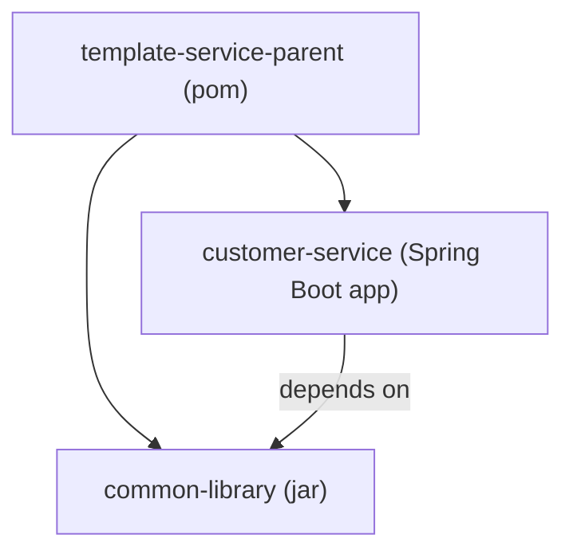
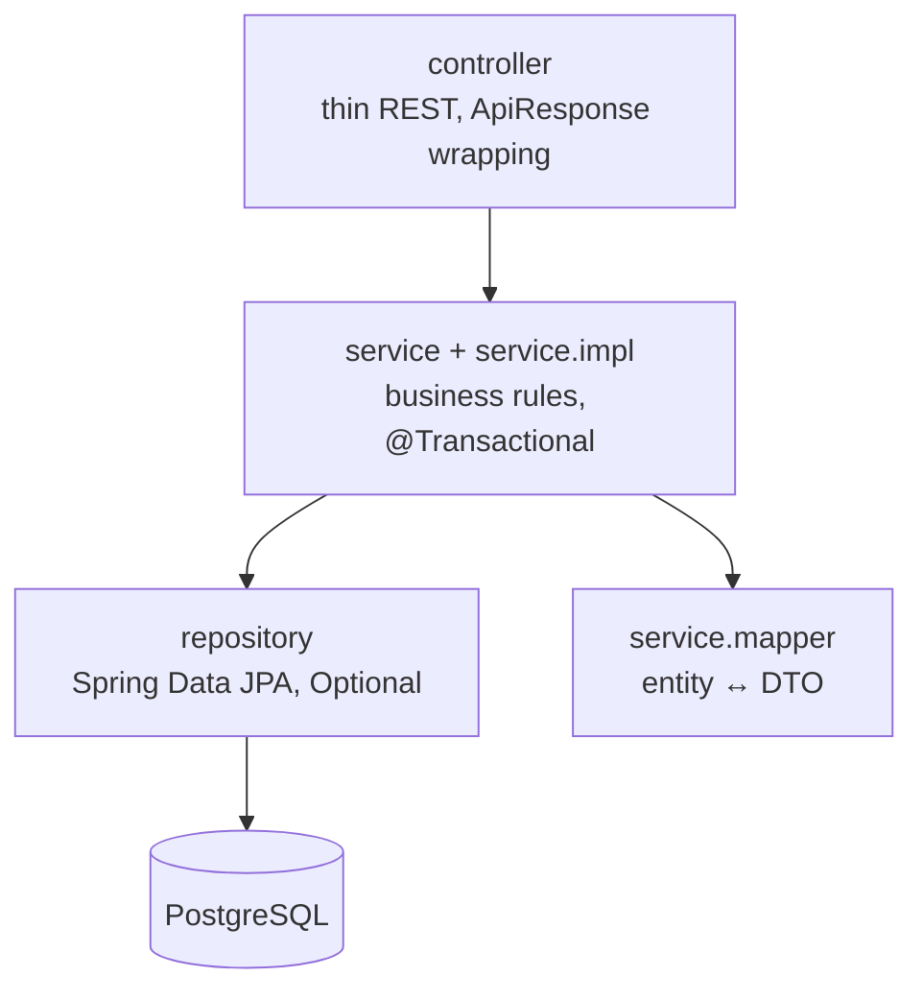
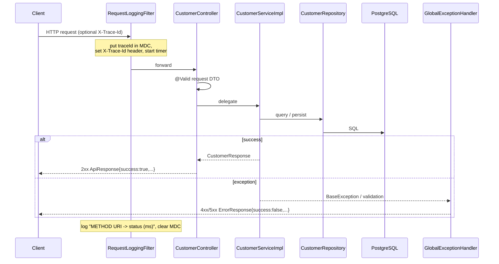
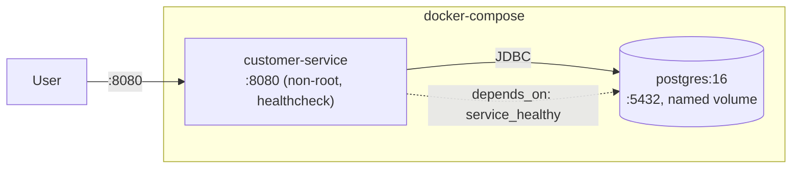

# Architecture — 00-template-service

This document describes the structure and runtime behavior of the template service. It is the reference for *why* the pieces are arranged the way they are; copied projects keep this shape.

## 1. Module structure

Maven multi-module build with a parent aggregator POM.



- **`common-library`** (`com.enterprise.common`) — reusable, app-agnostic foundation. No `@SpringBootApplication`, no domain code.
- **`customer-service`** (`com.enterprise.customer`) — the runnable application; the only executable jar.

## 2. Layered architecture

A strict one-directional dependency flow. Each layer only talks to the one below it.



Rules enforced:

- Controllers contain **no business logic** — they validate input and delegate.
- `@Transactional` lives **only** in the service layer (`readOnly` on queries).
- Entities are **never** returned from controllers — only `CustomerRequest`/`CustomerResponse` DTOs.
- Repositories return **`Optional`**, never null.
- Constructor injection everywhere (no field `@Autowired`).

## 3. Package layout (customer-service)

```
com.enterprise.customer
├── CustomerServiceApplication      # @SpringBootApplication(scanBasePackages = "com.enterprise")
├── config        # RequestLoggingFilter, OpenApiConfig, JpaConfig
├── controller    # CustomerController
├── service       # CustomerService (interface)
│   ├── impl       # CustomerServiceImpl (@Transactional)
│   └── mapper     # CustomerMapper
├── repository    # CustomerRepository
├── entity        # Customer, CustomerStatus
├── dto           # CustomerRequest, CustomerResponse
├── validation    # (custom validators, as needed)
├── util          # (service-local helpers)
└── common        # CustomerErrorCodes (domain-specific codes)
```

> Component scanning is rooted at `com.enterprise` so the `@RestControllerAdvice` and other beans from `common-library` are discovered alongside the service's own components.

## 4. Request lifecycle



## 5. Cross-cutting contracts (from common-library)

| Concern | Type | Shape / behavior |
|---|---|---|
| Success envelope | `ApiResponse<T>` | `{ success:true, data, message }` |
| Error envelope | `ErrorResponse` | `{ success:false, errorCode, message, timestamp, path, errors? }` |
| Exceptions | `BaseException` → `ResourceNotFoundException`, `BusinessException`, `ValidationException` | each carries `HttpStatus` + stable `errorCode` |
| Error mapping | `GlobalExceptionHandler` (`@RestControllerAdvice`) | single place exceptions become HTTP responses |
| Auditing | `AuditEntity` (`@MappedSuperclass`) | `createdAt`, `updatedAt`, `version` (optimistic locking) |
| Tracing/logging | `RequestLoggingFilter` + `Constants.TRACE_ID*` | MDC trace id, response header, per-request summary line |

### Exception → HTTP mapping

| Exception | HTTP | errorCode |
|---|---|---|
| `ResourceNotFoundException` | 404 | `RESOURCE_NOT_FOUND` / domain code (e.g. `CUSTOMER_NOT_FOUND`) |
| `ValidationException` / Bean Validation | 400 | `VALIDATION_ERROR` (+ per-field `errors`) |
| `BusinessException` | 409 | `BUSINESS_RULE_VIOLATION` / domain code (e.g. `CUSTOMER_EMAIL_EXISTS`) |
| any uncaught `Exception` | 500 | `INTERNAL_ERROR` (detail hidden, logged with stack trace) |

## 6. Persistence & migrations

- **Flyway** owns the schema: `src/main/resources/db/migration/V1__create_customer_table.sql`.
- Hibernate runs with **`ddl-auto=validate`** — it never generates schema and fails fast on drift.
- `Instant` fields map to `TIMESTAMP` (UTC-normalized via `hibernate.type.preferred_instant_jdbc_type=TIMESTAMP` + `jdbc.time_zone=UTC`) for deterministic validation.

## 7. Runtime topology (Docker)



The image is multi-stage (Maven build → slim Alpine JRE). The app waits for Postgres health before starting; its own `HEALTHCHECK` polls `/actuator/health`.

## 8. Testing architecture

| Tier | Naming | Runner | Loads | Needs Docker |
|---|---|---|---|---|
| Unit | `*Test` | Surefire (`test`) | no Spring context | no |
| Integration | `*IT` | Failsafe (`verify`) | Spring slice / full context | yes (Testcontainers) |

Integration tests: `CustomerRepositoryIT` (data slice), `CustomerControllerIT` (web slice, mocked service), `ApplicationSmokeIT` (full stack on a random port).
