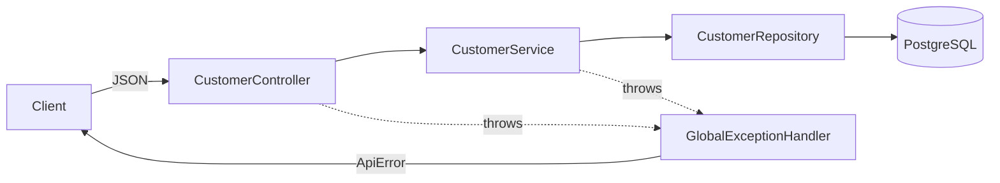

# basic-crud

The simplest correct CRUD REST service in the lab — the first step of the `01-foundation` didactic progression. Single Maven module, no shared library, plain DTO responses, and a minimal centralized error handler. It is deliberately leaner than `00-template-service` so the contrast with the next project (`layered-architecture`) is visible.

## Architectural Objective

Show REST CRUD and correct HTTP semantics with the least structure that is still *done right*: thin controller, a service layer owning transactions, a Spring Data repository, DTOs in/out, Bean Validation, and one place that turns errors into responses.

## Business Scenario

The **Customer** domain (register and manage customers) — the simplest aggregate in the Supply Chain & Order Fulfillment platform, chosen so the focus stays on CRUD fundamentals rather than domain complexity.

## Problem Statement

What does a minimal, production-shaped CRUD service look like before any cross-cutting framework (response envelopes, shared libraries, tracing) is layered on? This project answers that and serves as the baseline a learner reads first.

## Solution & Design Decisions

| Decision | Rationale |
|---|---|
| **Single module**, no `common-library` | Smallest footprint; everything to read is in one place |
| **Plain DTO responses** (no `ApiResponse` envelope) | Bare-bones; the envelope is introduced in `layered-architecture` |
| **One concrete `CustomerService`** (no interface/impl/mapper split) | Minimal indirection; mapping is inline |
| **Minimal inline `@RestControllerAdvice`** → `{timestamp,status,error,message,path}` | Centralized errors without a full exception hierarchy |
| Hibernate `@CreationTimestamp`/`@UpdateTimestamp` | Audit timestamps without JPA-auditing configuration |
| Flyway + `ddl-auto=validate` | Schema owned by migrations; consistent with the lab stack |
| Proper status codes (201+Location, 204 on delete, 404, 400, 409) | "CRUD done right" |

## Architecture Diagram



## Implementation Approach

- `controller/CustomerController` — thin; `@Valid` bodies, returns plain DTOs / `ResponseEntity`.
- `service/CustomerService` — `@Transactional`, inline entity↔DTO mapping, throws `NotFoundException`.
- `repository/CustomerRepository` — Spring Data JPA, `Optional` returns.
- `entity/Customer` — Hibernate-managed timestamps.
- `exception/` — `NotFoundException`, plain `ApiError` body, and the inline `GlobalExceptionHandler`.
- `db/migration/V1__create_customer_table.sql` — Flyway-owned schema.

## Setup & Run

```bash
# Full stack in Docker
docker compose up --build            # app on :8080, Postgres on :5432

# Local (Postgres in Docker, app on host)
docker compose up -d postgres
mvn spring-boot:run
```

Target JDK is 21 — if `mvn` runs under a newer JDK, set `JAVA_HOME` to a JDK 21.

## API Documentation

- Swagger UI: `http://localhost:8080/swagger-ui.html`
- OpenAPI JSON: `http://localhost:8080/v3/api-docs`

| Method | Path | Success |
|---|---|---|
| POST | `/api/v1/customers` | 201 + `Location` |
| GET | `/api/v1/customers/{id}` | 200 |
| GET | `/api/v1/customers` | 200 (array) |
| PUT | `/api/v1/customers/{id}` | 200 |
| DELETE | `/api/v1/customers/{id}` | 204 |

Errors return a plain body: `{timestamp, status, error, message, path}` (plus `errors[]` for validation). 404 (not found), 400 (validation), 409 (duplicate email).

## Testing

```bash
mvn clean verify      # unit + integration (Testcontainers; Docker required)
mvn clean test        # unit only (no Docker)
```

- **Unit** (`CustomerServiceTest`, Surefire): service logic with Mockito.
- **Integration** (`*IT`, Failsafe): `CustomerRepositoryIT` (real Postgres via Testcontainers) and `CustomerControllerIT` (`@WebMvcTest` + MockMvc, no Docker).

## Operational Considerations

- `/actuator/health` for liveness/readiness (used by the container healthcheck); `/actuator/info` enabled.
- 12-factor config: datasource and port via env vars; `docker` profile targets the compose Postgres.
- Flyway runs on startup; `validate` fails fast on schema drift.
- No tracing/MDC filter or response envelope here by design — those arrive with the template-derived projects.
