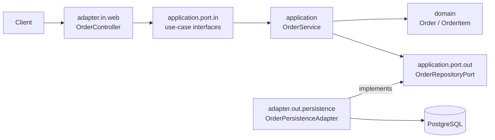

# clean-architecture

The third step of the `01-foundation` progression: an **Order** service organized by Clean Architecture's **dependency rule**. Where `layered-architecture` arranges code by technical layer, this project arranges it by **ports & adapters** with a framework-free core — and *verifies* the rule with an ArchUnit test.

## Architectural Objective

Make the domain and use-cases independent of frameworks. Dependencies point **inward**: `adapter` → `application` → `domain`. The domain and application layers have zero Spring/JPA imports; infrastructure plugs in behind ports.

## Business Scenario

The **Order** aggregate (place, query, cancel) with line items. Business rules live in the domain (an order needs items; a shipped order can't be cancelled; totals are computed from items).

## Problem Statement

How do you keep business logic testable and insulated from delivery/persistence choices, so frameworks are details you could swap? Clean Architecture answers with the dependency rule — but a rule is only real if it's enforced.

## Solution & Design Decisions

| Decision | Rationale |
|---|---|
| `domain` / `application` are framework-free | The core is plain Java; unit-testable without Spring |
| Input ports (`PlaceOrder`, `OrderQuery`, `CancelOrder`) + output port (`OrderRepositoryPort`) | Use-cases depend on abstractions, not infrastructure |
| Use-case `OrderService` has **no** Spring annotations; wired via `@Bean` in `config` | Keeps the application layer pure |
| Spring/JPA confined to `adapter` (web in, persistence out) | Infrastructure is replaceable |
| **ArchUnit** `DependencyRuleTest` | The dependency rule is verified on every build, not just documented |
| Single deployable module | Clean Architecture here is package-level discipline (contrast: `multi-module` enforces it physically) |

## Architecture Diagram



Arrows point in the direction of source-code dependencies — always inward, toward the domain.

## Implementation Approach

- `domain/` — `Order`, `OrderItem`, `OrderStatus` (pure POJOs with invariants).
- `application/` — use-case interfaces (`port/in`), the persistence gateway (`port/out`), `OrderService`, `OrderNotFoundException`.
- `adapter/in/web/` — `OrderController`, DTOs, `OrderWebMapper`, local `ApiResponse`/`ErrorResponse`, `GlobalExceptionHandler`.
- `adapter/out/persistence/` — JPA entities, `SpringDataOrderRepository`, `OrderPersistenceAdapter` (implements the port), mapper. Transactions live here.
- `config/UseCaseConfig` — wires the pure use-case as a bean.

## Setup & Run

```bash
docker compose up --build          # full stack on :8080 (Postgres on :5432)
# or local:
docker compose up -d postgres
mvn spring-boot:run
```

Target JDK is 21 — set `JAVA_HOME` to a JDK 21 if `mvn` defaults to a newer one.

## API Documentation

- Swagger UI: `http://localhost:8080/swagger-ui.html` · OpenAPI: `/v3/api-docs`

| Method | Path | Success |
|---|---|---|
| POST | `/api/v1/orders` | 201 + `Location` |
| GET | `/api/v1/orders/{id}` | 200 |
| GET | `/api/v1/orders` | 200 |
| POST | `/api/v1/orders/{id}/cancel` | 200 |

Errors: 400 `VALIDATION_ERROR` / `INVALID_ORDER`, 404 `ORDER_NOT_FOUND`, 409 `INVALID_ORDER_STATE` (e.g. cancelling a shipped order).

## Testing

```bash
mvn clean verify      # unit + integration (Testcontainers; Docker required)
```

- **Architecture** (`DependencyRuleTest`, ArchUnit): proves `domain`/`application` depend on no outer layer or framework.
- **Unit**: `OrderTest` (domain), `OrderServiceTest` (use-cases, Mockito).
- **Integration** (`*IT`): `OrderControllerIT` (`@WebMvcTest`), `OrderPersistenceAdapterIT` (Testcontainers, domain↔JPA round-trip), `ApplicationSmokeIT` (full stack place→get→cancel).

## Operational Considerations

- `/actuator/health|info|metrics`; Flyway owns schema (`validate`).
- 12-factor config; `docker` profile targets the compose Postgres.
- Swapping persistence (e.g. to another store) means writing a new output-port adapter — the domain and use-cases don't change.
