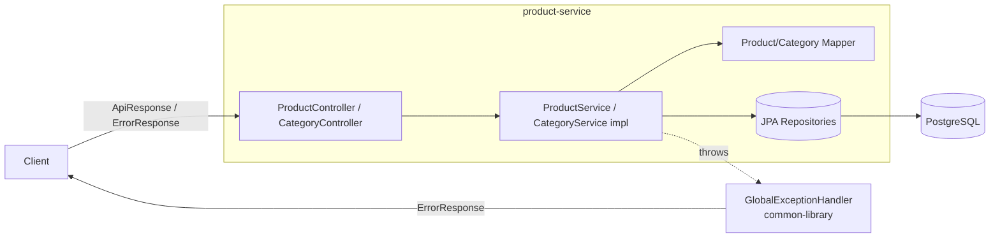

# layered-architecture

The second step of the `01-foundation` progression: a properly **layered** service that makes the Controller → Service → Repository separation and the DTO-mapping boundary the explicit lesson. Unlike `basic-crud`, this project **derives from the template** — multi-module (`common-library` + `product-service`) with the shared `ApiResponse`/`ErrorResponse` envelopes, centralized exceptions, and structured logging.

## Architectural Objective

Show clean layering with a clear separation of concerns: a thin controller, a service layer that owns transactions and business rules, a repository for data access, and a mapper that keeps JPA entities out of the API. Contrast with `basic-crud` (single module, inline mapping, plain responses).

## Business Scenario

The **Product** catalog with a supporting **Category** lookup. Products have a mandatory category, a unique SKU, and a price — enough domain logic to give the service layer real work (uniqueness checks, association resolution).

## Problem Statement

How should responsibilities be split across layers so each has one job, the API contract is stable, and business rules live in exactly one place? This project is the canonical layered answer, reused by every template-derived project.

## Solution & Design Decisions

| Decision | Rationale |
|---|---|
| Multi-module (`common-library` + `product-service`) | Reuses the shared envelopes, exception handler, auditing, logging |
| Service interface + `impl` + dedicated `mapper` | Explicit layering; mapping is a named responsibility (vs. inline in `basic-crud`) |
| `ApiResponse`/`ErrorResponse` envelopes | Consistent, machine-readable success/error contracts |
| Business rules in the service | Unique SKU → 409; missing category → 404 — enforced once |
| `Product → Category` (ManyToOne) | Demonstrates association mapping across layers |
| Flyway + `ddl-auto=validate`, `AuditEntity` | Same persistence discipline as the template |

## Architecture Diagram



## Implementation Approach

- `controller/` — `ProductController` (full CRUD), `CategoryController` (create/list/get); wrap payloads in `ApiResponse`.
- `service/` + `service/impl/` — interfaces and transactional implementations; business rules here.
- `service/mapper/` — `ProductMapper`, `CategoryMapper` (pure entity↔DTO translation; category resolved by the service).
- `repository/` — Spring Data JPA, `Optional` returns.
- `entity/` — `Product` (→ `Category`), both extend `common-library`'s `AuditEntity`.
- `db/migration/V1__create_product_tables.sql` — Flyway-owned schema.
- `common-library` — unchanged shared foundation (envelopes, exceptions, auditing).

## Setup & Run

```bash
docker compose up --build          # full stack on :8080 (Postgres on :5432)
# or local:
docker compose up -d postgres
mvn spring-boot:run -pl product-service
```

Target JDK is 21 — set `JAVA_HOME` to a JDK 21 if `mvn` defaults to a newer one.

## API Documentation

- Swagger UI: `http://localhost:8080/swagger-ui.html` · OpenAPI: `/v3/api-docs`

| Method | Path | Success |
|---|---|---|
| POST | `/api/v1/categories` | 201 |
| GET | `/api/v1/categories` / `/{id}` | 200 |
| POST | `/api/v1/products` | 201 |
| GET | `/api/v1/products` (paged) / `/{id}` | 200 |
| PUT | `/api/v1/products/{id}` | 200 |
| DELETE | `/api/v1/products/{id}` | 200 |

Errors use the unified `ErrorResponse`: 400 `VALIDATION_ERROR`, 404 `PRODUCT_NOT_FOUND` / `CATEGORY_NOT_FOUND`, 409 `PRODUCT_SKU_EXISTS` / `CATEGORY_NAME_EXISTS`.

## Testing

```bash
mvn clean verify      # unit + integration (Testcontainers; Docker required)
```

- **Unit** (`ProductServiceImplTest`, `CategoryServiceImplTest`): service rules with Mockito (real mappers).
- **Integration** (`*IT`): `ProductRepositoryIT` (Testcontainers Postgres), `ProductControllerIT` (`@WebMvcTest`), `ApplicationSmokeIT` (full stack — category → product flow).

## Operational Considerations

- `/actuator/health|info|metrics`; structured request logging with trace id (inherited from the template).
- 12-factor config; `docker` profile targets the compose Postgres.
- Flyway runs on startup; `validate` fails fast on schema drift.
