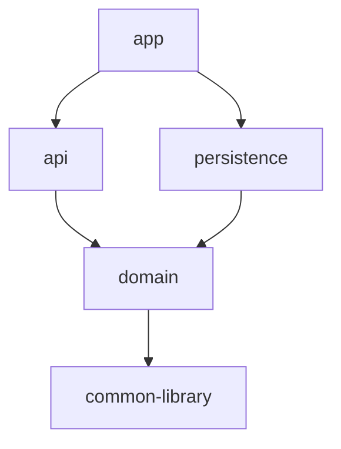

# multi-module

The fourth step of the `01-foundation` progression: the same layered concerns, but split into **physical Maven modules** so the dependency direction is enforced by the build itself. Where `clean-architecture` enforces boundaries at the *package* level (and verifies them with ArchUnit), this project enforces them *physically* — you literally cannot compile an upward dependency.

## Architectural Objective

Demonstrate module decomposition and compile-time boundary enforcement via the Maven reactor. Each concern is its own artifact; the dependency graph is acyclic and points one way.

## Business Scenario

The **Customer** domain (kept deliberately simple) — the focus is the module split, not domain complexity.

## Module Structure & Dependencies



| Module | Contains | Depends on |
|---|---|---|
| `common-library` | `ApiResponse`, `ErrorResponse`, exceptions, `GlobalExceptionHandler`, `AuditEntity` | — |
| `domain` | `Customer` entity, `CustomerService` (+impl), `CustomerRepository` **port** | common-library |
| `persistence` | `CustomerJpaRepository` (Spring Data) **implementing the port** | domain |
| `api` | `CustomerController`, DTOs, `CustomerMapper` | domain, common-library |
| `app` | `@SpringBootApplication`, config, migrations — the only runnable jar | api, persistence |

The reactor guarantees the arrows: `persistence` cannot see `api`, `domain` cannot see either, and the repository port is declared in `domain` but implemented in `persistence`.

## Solution & Design Decisions

| Decision | Rationale |
|---|---|
| Repository **port** in `domain`, Spring Data impl in `persistence` | Inverts the dependency: domain owns the contract, infra fulfils it |
| `CustomerJpaRepository extends JpaRepository<Customer,Long>, CustomerRepository` | Spring Data satisfies the port automatically (CRUD + derived queries) |
| `app` declares explicit `@EntityScan` + `@EnableJpaRepositories` | Entities/repositories live in sibling packages, so scan boundaries are explicit |
| Only `app` is executable (`spring-boot-maven-plugin`) | Library modules stay plain jars |

## Implementation Approach

- Read `domain` first: `CustomerService`/`CustomerServiceImpl` and the `CustomerRepository` port.
- `persistence/CustomerJpaRepository` shows the port being fulfilled by Spring Data.
- `app/MultiModuleApplication` shows the cross-module wiring (`scanBasePackages`, `@EntityScan`, `@EnableJpaRepositories`).

## Setup & Run

```bash
docker compose up --build          # full stack on :8080 (Postgres on :5432)
# or local:
docker compose up -d postgres
mvn -pl app -am spring-boot:run
```

Target JDK is 21 — set `JAVA_HOME` to a JDK 21 if `mvn` defaults to a newer one.

## API Documentation

- Swagger UI: `http://localhost:8080/swagger-ui.html` · OpenAPI: `/v3/api-docs`
- `/api/v1/customers` — POST (201), GET `/{id}`, GET (list), PUT `/{id}`, DELETE. Wrapped in `ApiResponse`.
- Errors: 400 `VALIDATION_ERROR`, 404 `CUSTOMER_NOT_FOUND`, 409 `CUSTOMER_EMAIL_EXISTS`.

## Testing

```bash
mvn clean verify      # unit + integration (Testcontainers; Docker required)
```

- **Unit** lives with its module: `domain/CustomerServiceImplTest` (Mockito over the port).
- **Integration** lives in `app` (where the `@SpringBootApplication` is): `CustomerControllerIT` (`@WebMvcTest`), `CustomerJpaRepositoryIT` (Testcontainers), `ApplicationSmokeIT` (full stack across all modules).

## Operational Considerations

- `/actuator/health|info|metrics`; Flyway owns schema (`validate`).
- 12-factor config; `docker` profile targets the compose Postgres.
- Adding a feature touches the module that owns it; the reactor stops accidental cross-layer coupling at compile time.
