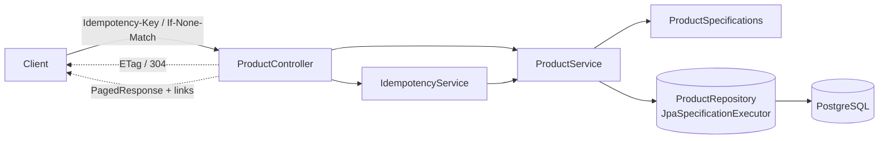

# rest-api-best-practices

The final step of the `01-foundation` progression: a Product API that layers on the **REST design concerns** a production API is expected to handle — URI versioning, pagination, filtering & sorting, a unified error format, HATEOAS-lite links, **idempotency keys**, and **ETag** conditional requests.

## Architectural Objective

Demonstrate the cross-cutting API qualities that make a service pleasant and safe to consume — beyond plain CRUD.

## Business Scenario

The **Product** catalog. Clients page and filter large result sets, retry creates safely, and re-fetch efficiently.

## Features

| Concern | How it's done |
|---|---|
| **URI versioning** | All routes under `/api/v1/...` (documented path to `v2`) |
| **Pagination & sorting** | `?page=&size=&sort=price,desc` via `Pageable` |
| **Filtering** | `?name=&status=&minPrice=&maxPrice=` via JPA `Specification` (`ProductSpecifications`) |
| **Unified errors** | `ErrorResponse` `{success,errorCode,message,timestamp,path,errors?}` from one handler |
| **HATEOAS-lite** | List responses carry `links.self/next/prev` (`PagedResponse`) |
| **Idempotency keys** | `Idempotency-Key` header + `idempotency_keys` table → retried POST returns the original product |
| **Conditional requests** | `GET /{id}` returns an `ETag` (entity version); `If-None-Match` → `304 Not Modified` |

## Architecture Diagram



## Implementation Approach

- `controller/ProductController` — versioned routes; reads `Idempotency-Key`/`If-None-Match`; builds ETags and paged link envelopes.
- `service/IdempotencyService` — dedupes creates by key.
- `service/ProductService` + `impl` — business rules; filtered listing via Specifications.
- `repository/spec/ProductSpecifications` — dynamic predicate building from `ProductFilter`.
- `common/PagedResponse` — content + page metadata + navigation links.
- `entity/Product` — `@Version` powers both optimistic locking and the ETag.

## Setup & Run

```bash
docker compose up --build          # full stack on :8080 (Postgres on :5432)
# or local:
docker compose up -d postgres
mvn spring-boot:run
```

Target JDK is 21 — set `JAVA_HOME` to a JDK 21 if `mvn` defaults to a newer one.

## API Documentation

- Swagger UI: `http://localhost:8080/swagger-ui.html` · OpenAPI: `/v3/api-docs`

```bash
# Idempotent create (run twice with the same key → same product, no duplicate)
curl -X POST http://localhost:8080/api/v1/products \
  -H 'Content-Type: application/json' -H 'Idempotency-Key: key-123' \
  -d '{"name":"Widget","sku":"SKU-1","price":19.99}'

# Filter + sort + page
curl 'http://localhost:8080/api/v1/products?status=ACTIVE&minPrice=10&sort=price,desc&page=0&size=20'

# Conditional GET (re-fetch with the returned ETag → 304)
curl -i http://localhost:8080/api/v1/products/1
curl -i http://localhost:8080/api/v1/products/1 -H 'If-None-Match: "0"'
```

Errors use the unified `ErrorResponse`: 400 `VALIDATION_ERROR`, 404 `PRODUCT_NOT_FOUND`, 409 `PRODUCT_SKU_EXISTS`.

## Testing

```bash
mvn clean verify      # unit + integration (Testcontainers; Docker required)
```

- **Unit**: `ProductServiceImplTest` (Mockito).
- **Integration** (`*IT`): `ProductControllerIT` (`@WebMvcTest` — ETag/304, links, idempotency passthrough), `ProductRepositoryIT` (Testcontainers — Specification filtering), `ApplicationSmokeIT` (full stack — idempotent create, ETag 304, filtered list).

## Operational Considerations

- `/actuator/health|info|metrics`; Flyway owns schema (`validate`).
- Idempotency keys are persisted; a production system would also TTL/expire them.
- ETags here are derived from the row version (strong validator); pair with `If-Match` on writes to prevent lost updates (left as an extension).
